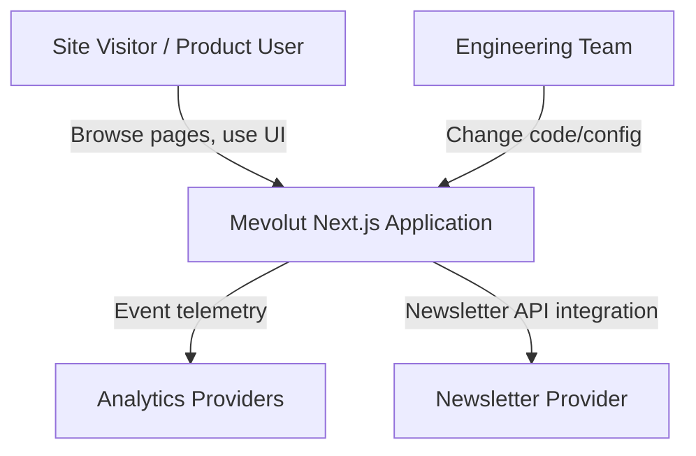
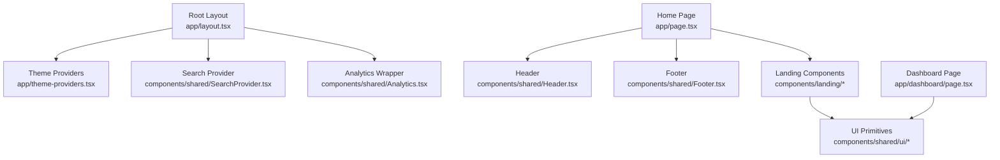
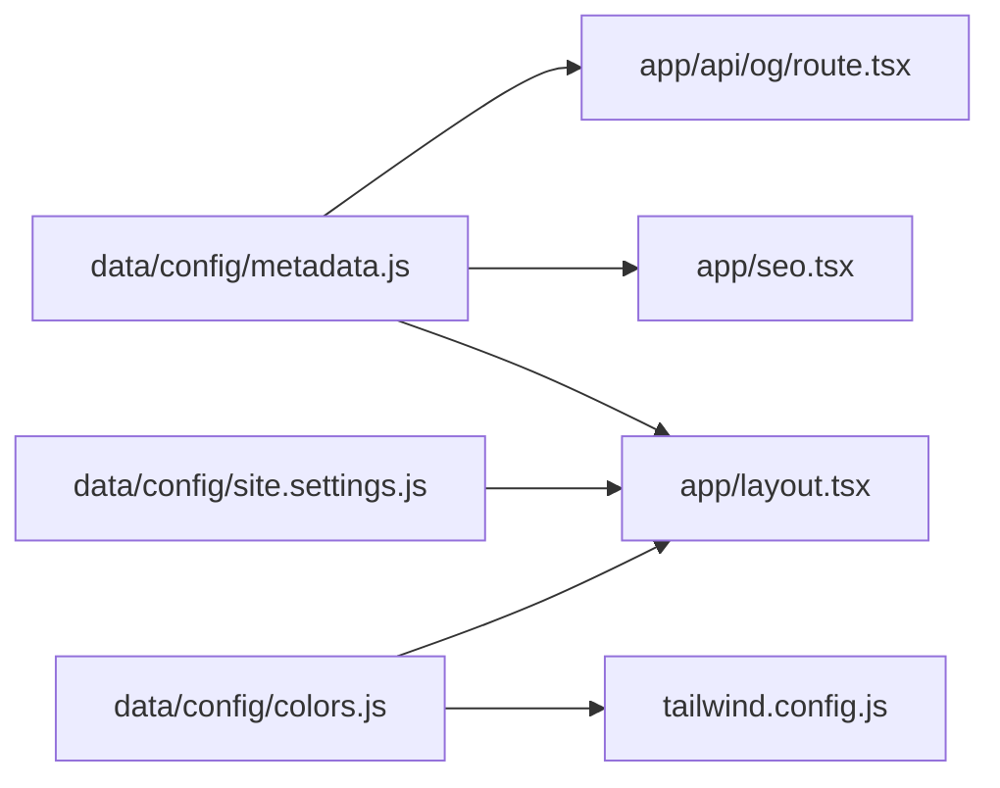
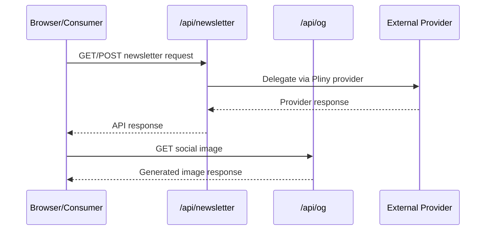
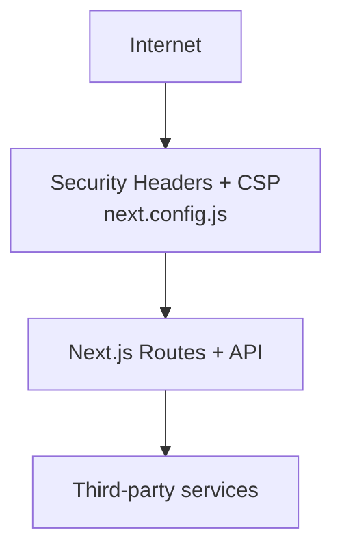

# Architecture Diagrams

## C4 Level 1 - System Context



## C4 Level 2 - Container View

```mermaid
flowchart LR
  Browser[Browser Client]
  NextApp[Next.js App Runtime]
  Config[Config Modules\ndata/config/*]
  API1[/api/newsletter]
  API2[/api/og]
  Static[Static Assets\npublic/*]
  ExtAnalytics[Analytics Services]
  ExtNewsletter[Newsletter Service]

  Browser --> NextApp
  NextApp --> Config
  NextApp --> API1
  NextApp --> API2
  API2 --> Static
  NextApp --> ExtAnalytics
  API1 --> ExtNewsletter
```

## C4 Level 3 - Component View (Application Runtime)



## Data Flow - Config to Runtime



## Public API Surface



## Security Boundary View


